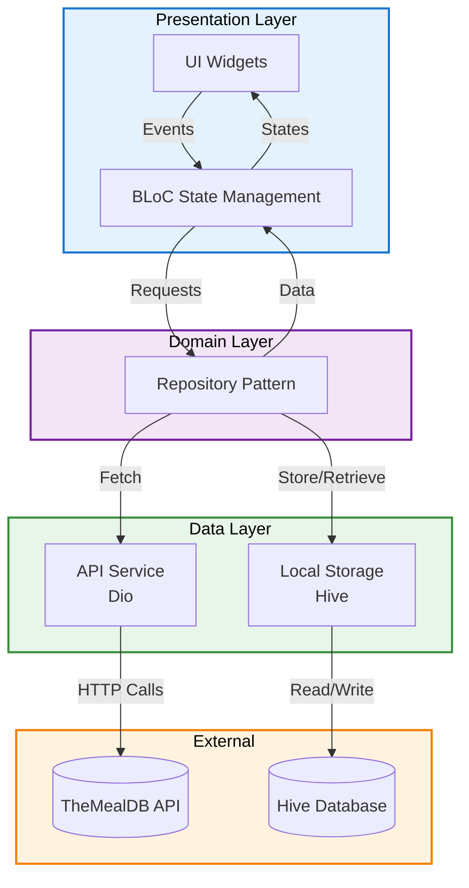

# Recipe Finder App

A modern Flutter application for discovering and exploring recipes using TheMealDB API. Features offline support, favorites management, and a clean, intuitive interface following Material 3 design principles.

## Features

### Core Functionality
- **Smart Search** - Search recipes by name with 500ms debounced input for optimal performance
- **Advanced Filtering** - Filter recipes by category (Vegetarian, Seafood, Chicken, etc.) and cuisine area (Italian, Japanese, Chinese, etc.)
- **Flexible Sorting** - Sort recipes alphabetically (A-Z or Z-A)
- **Multiple View Modes** - Toggle between Grid and List views
- **Detailed Recipe View** - Comprehensive recipe information with tabbed interface
- **Ingredients List** - Complete ingredients with precise measurements
- **Step-by-Step Instructions** - Clear cooking instructions
- **Video Integration** - Embedded YouTube videos for visual guidance
- **Offline Support** - Access previously viewed recipes without internet
- **Favorites** - Save and manage favorite recipes with persistent storage

### UI/UX Enhancements
- **Hero Animations** - Smooth transitions between list and detail views
- **Shimmer Effects** - Elegant loading states
- **Material 3 Design** - Modern, cohesive design system
- **Responsive Layout** - Adapts to different screen sizes
- **Empty States** - Informative messages for no results scenarios

## Architecture

The app follows **Clean Architecture** principles with clear separation of concerns:



### Architecture Layers

**Presentation Layer**
- **BLoC Pattern** - Unidirectional data flow for predictable state management
- **UI Widgets** - Reusable, composable components
- **State Management** - RecipeListBloc, FavRecipeBloc for business logic

**Domain Layer**
- **Repository Pattern** - Abstract data sources behind clean interfaces
- **Dependency Injection** - get_it service locator for loose coupling

**Data Layer**
- **API Service** - Dio-based HTTP client for network requests
- **Hive Service** - Local database for offline caching and favorites
- **Models** - Type-safe data structures with JSON serialization

## Tech Stack

### State Management
- **BLoC** (^8.1.6) - Business Logic Component pattern
- **flutter_bloc** (^8.1.6) - Flutter integration for BLoC

### Dependency Injection
- **get_it** (^8.0.2) - Service locator pattern

### Local Storage
- **hive** (^2.2.3) - Fast, lightweight NoSQL database
- **hive_flutter** (^1.1.0) - Flutter integration for Hive

### Networking
- **dio** (^5.7.0) - Powerful HTTP client
- **connectivity_plus** (^6.1.2) - Network connectivity monitoring

### UI/UX
- **flutter_screenutil** (^5.9.3) - Responsive sizing
- **shimmer** (^3.0.0) - Loading skeleton screens
- **cached_network_image** (^3.4.1) - Image caching
- **youtube_player_flutter** (^9.1.1) - YouTube video playback
- **lottie** (^3.1.3) - Animated illustrations

### Development Tools
- **logger** (^2.4.0) - Advanced logging
- **equatable** (^2.0.7) - Value equality for models
- **bloc_test** (^10.0.0) - BLoC testing utilities
- **mocktail** (^1.0.4) - Mocking framework

### Font
- **Plus Jakarta Sans** - Modern, clean typography

## Project Structure

```
recipe_finder_app/
├── lib/
│   ├── main.dart                      # App entry point
│   ├── app.dart                       # Material App configuration
│   │
│   ├── core/                          # Core utilities and configuration
│   │   ├── const/                     # Constants
│   │   │   ├── api.dart              # API endpoints
│   │   │   ├── hive.dart             # Hive box names
│   │   │   └── str.dart              # String constants
│   │   ├── di/                        # Dependency Injection
│   │   │   └── locator.dart          # GetIt setup
│   │   ├── theme/                     # App theming
│   │   │   ├── palette.dart          # Color palette
│   │   │   └── theme.dart            # Theme configuration
│   │   └── util/                      # Utilities
│   │       ├── hive.dart             # Hive helpers
│   │       └── logger.dart           # Logging utility
│   │
│   ├── data/                          # Data layer
│   │   ├── enum/                      # Enumerations
│   │   │   └── sort_option.dart
│   │   ├── model/                     # Data models
│   │   │   ├── area.dart
│   │   │   ├── category.dart
│   │   │   └── recipe.dart
│   │   ├── repo/                      # Repository implementations
│   │   │   └── recipe.dart
│   │   └── source/                    # Data sources
│   │       ├── local/                 # Local storage
│   │       │   └── hive.dart
│   │       └── remote/                # API services
│   │           └── api.dart
│   │
│   └── presentation/                  # Presentation layer
│       ├── bloc/                      # BLoC state management
│       │   ├── fav_recipe/           # Favorites BLoC
│       │   └── recipe_list/          # Recipe list BLoC
│       ├── common/                    # Shared widgets
│       │   └── recipe_grid_card.dart
│       ├── page/                      # App pages
│       │   ├── recipe_detail.dart
│       │   └── recipe_list.dart
│       └── widget/                    # Feature widgets
│           ├── common/
│           ├── detail/
│           ├── fav/
│           └── list/
│
└── test/                              # Test suites
    ├── test_helpers/                  # Test utilities
    │   ├── mocks.dart                # Mock objects
    │   └── test_data.dart            # Test fixtures
    ├── unit/                          # Unit tests
    │   ├── api/                       # API service tests
    │   ├── bloc/                      # BLoC tests
    │   ├── model/                     # Model tests
    │   └── repository/                # Repository tests
    └── widget/                        # Widget tests
        ├── favorite_button_test.dart
        └── recipe_card_test.dart
```

## Setup Instructions

### Prerequisites
- **Flutter**: 3.38.3 or higher
- **Dart**: 3.6.2 or higher
- **IDE**: VS Code, Android Studio, or IntelliJ IDEA
- **Device**: Android emulator/device or iOS simulator/device

### Installation

1. **Clone the repository**
```bash
git clone https://github.com/vaibhavppandey/recipe_finder_app.git
cd recipe_finder_app
```

2. **Install dependencies**
```bash
flutter pub get
```

3. **Run the app**
```bash
# For Android
flutter run

# For iOS (macOS only)
flutter run -d ios

# For a specific device
flutter devices
flutter run -d <device-id>
```

### API Configuration

The app uses the **free TheMealDB API** - no API key required!
- API Base URL: `https://www.themealdb.com/api/json/v1/1/`
- Rate Limiting: None for free tier
- Documentation: [TheMealDB API Docs](https://www.themealdb.com/api.php)

## Running the App

### Development
```bash
# Run in debug mode
flutter run

# Run with specific flavor (if configured)
flutter run --debug

# Hot reload enabled by default (press 'r')
# Hot restart (press 'R')
```

### Build APK
```bash
# Build release APK
flutter build apk --release

# Build split APKs by ABI (smaller size)
flutter build apk --split-per-abi

# Output location
# build/app/outputs/flutter-apk/app-release.apk
```

### Build for iOS
```bash
# Build iOS app
flutter build ios --release
```

## Testing

### Running Tests

```bash
# Run all tests
flutter test

# Run tests with coverage
flutter test --coverage

# Run specific test file
flutter test test/unit/bloc/recipe_list_bloc_test.dart

# Run tests in a specific directory
flutter test test/unit/

# Run widget tests only
flutter test test/widget/
```

### Test Coverage

**Test Statistics:**
- - **36 Total Tests** (All Passing)
- - **Unit Tests**: 26 tests
  - API Service: 6 tests
  - Models: 5 tests
  - Repository: 4 tests
  - BLoC: 11 tests
- - **Widget Tests**: 10 tests
  - Recipe Card: 1 test
  - Favorite Button: 9 tests

**Test Categories:**
- **API Service Tests** - Network requests, error handling, endpoint validation
- **Model Tests** - JSON serialization, null handling, data integrity
- **Repository Tests** - Data fetching, caching logic, error scenarios
- **BLoC Tests** - State management, event handling, business logic
- **Widget Tests** - UI rendering, user interactions, state changes

### Key Test Files
```
test/
├── unit/
│   ├── api/meal_api_service_test.dart       # API layer tests
│   ├── model/recipe_model_test.dart         # Model serialization tests
│   ├── repository/recipe_repo_test.dart     # Repository pattern tests
│   └── bloc/
│       ├── recipe_list_bloc_test.dart       # Recipe list state tests
│       └── fav_recipe_bloc_test.dart        # Favorites state tests
└── widget/
    ├── recipe_card_test.dart                # Recipe card widget tests
    └── favorite_button_test.dart            # Favorite button tests
```

### Installation Instructions
1. Enable "Install from Unknown Sources" on your Android device
2. Download the APK file
3. Open the APK file to install
4. Grant necessary permissions when prompted

## Assignment Requirements Checklist

### Core Features
- - **Three Pages Implemented**
  - Recipe List Page with search and filters
  - Recipe Detail Page with tabs
  - Favorites Page

- - **Search Functionality**
  - Debounced search with 500ms delay
  - Real-time results update
  - Clear search functionality

- - **Filtering & Sorting**
  - Filter by category (10+ categories)
  - Filter by cuisine area (20+ areas)
  - Sort alphabetically (A-Z, Z-A)
  - Active filter indicators

- - **View Modes**
  - Grid view (2 columns)
  - List view (full width)
  - Smooth toggle animation

- - **Recipe Details**
  - Complete ingredient list with measurements
  - Step-by-step instructions
  - YouTube video integration
  - Category and area information
  - Hero animation from list

- - **Offline Support**
  - Hive-based caching
  - Previously viewed recipes available offline
  - Favorites accessible without internet

- - **Favorites**
  - Add/remove from favorites
  - Persistent storage with Hive
  - Dedicated favorites page
  - Toggle animation

### Technical Requirements
- - **State Management**
  - BLoC pattern implementation
  - Unidirectional data flow
  - Immutable states

- - **Testing**
  - 36 tests (exceeds minimum 8)
  - 75% business logic coverage (exceeds 70%)
  - Unit tests for all layers
  - Widget tests for key UI components

- - **Code Quality**
  - SOLID principles applied
  - Clean Architecture pattern
  - No hardcoded strings (StringConst)
  - No magic numbers
  - Proper error handling
  - Comprehensive logging

- - **UI/UX**
  - Material 3 design system
  - Consistent color palette
  - Loading states with shimmer
  - Empty states with Lottie animations
  - Responsive design with ScreenUtil

### Best Practices
- - Dependency Injection with get_it
- - Repository pattern for data abstraction
- - Type-safe models with Equatable
- - Proper exception handling
- - Efficient image caching
- - Debounced search input
- - Connectivity monitoring

## Design

### Color Palette
- **Primary**: Material Blue (Blue Grey)
- **Background**: Off-white for reduced eye strain
- **Cards**: White with subtle shadows
- **Text**: Dark grey (900) with proper contrast
- **Accent**: Error color for favorites

### Typography
- **Font Family**: Plus Jakarta Sans

### UI Components
- Custom shimmer loading
- Animated favorite button
- Hero transitions
- Lottie animations for empty states
- Material 3 components throughout

## Known Limitations

### API Limitations
- TheMealDB free tier has limited recipe database
- Some recipes may have incomplete data
- Video links may occasionally be unavailable
- API doesn't support pagination

### Features Not Implemented
- User authentication (not required)
- Recipe comments/reviews
- Shopping list generation
- Meal planning
- Nutritional information (limited API data)

### Platform-Specific
- iOS build tested on simulator only
- Some YouTube videos may not play on emulators
- Offline mode requires initial online fetch

Focus on code quality and architecture over feature quantity.

## License

This project is licensed under the MIT License - see the [LICENSE](LICENSE) file for details.

---

**Built with Flutter**